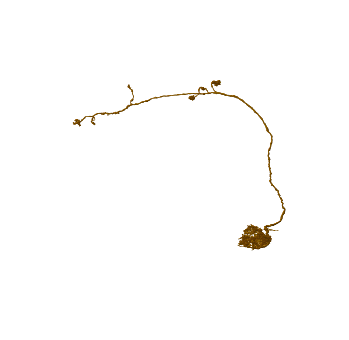
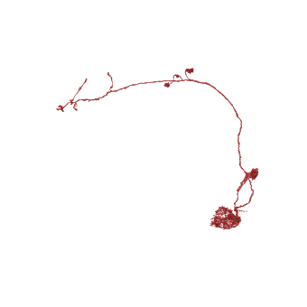
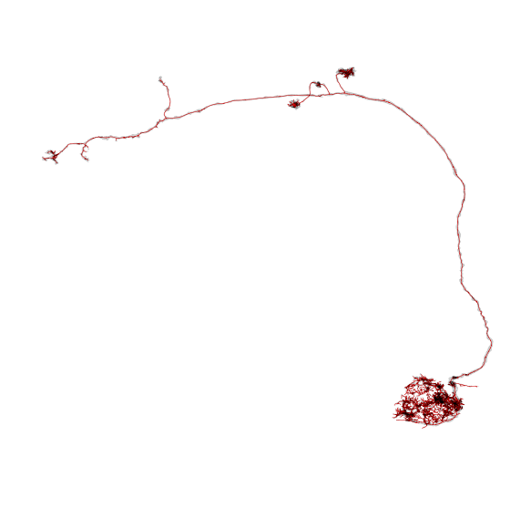

.. _flywire_neurons:

Fetching neurons
================
Fetching flywire neurons is straight forward:

.. code:: ipython3

    import navis
    import fafbseg

.. raw:: html

    

.. code:: ipython3

    # Fetch the neuron's mesh
    n = fafbseg.flywire.get_mesh_neuron(720575940617774213)
    n

.. raw:: html

    

    
    <table border="1" class="dataframe">
      <thead>
        <tr style="text-align: right;">
          <th></th>
          <th></th>
        </tr>
      </thead>
      <tbody>
        <tr>
          <th>type</th>
          <td>navis.MeshNeuron</td>
        </tr>
        <tr>
          <th>name</th>
          <td>None</td>
        </tr>
        <tr>
          <th>id</th>
          <td>720575940617774213</td>
        </tr>
        <tr>
          <th>units</th>
          <td>1 nanometer</td>
        </tr>
        <tr>
          <th>n_vertices</th>
          <td>265599</td>
        </tr>
        <tr>
          <th>n_faces</th>
          <td>532059</td>
        </tr>
      </tbody>
    </table>
    

.. code:: ipython3

    fig, ax = navis.plot2d(n)
    ax.azim = ax.elev = -90

Note that flywire neurons are very detailed: the above neuron has over half a million faces! That makes working with them slow and it's a good idea to downsample them if possible.

Alternatively, turn them into skeletons:

.. code:: ipython3

    # This fetches the neuron as mesh and then skeletonizes it 
    # Note that we set drop_soma_hairball=False because this neuron does not have a soma
    sk, _, _ = fafbseg.flywire.skeletonize_neuron(720575940617774213, drop_soma_hairball=False)
    sk

.. parsed-literal::

    

.. parsed-literal::

    

.. raw:: html

    

    
    <table border="1" class="dataframe">
      <thead>
        <tr style="text-align: right;">
          <th></th>
          <th></th>
        </tr>
      </thead>
      <tbody>
        <tr>
          <th>type</th>
          <td>navis.TreeNeuron</td>
        </tr>
        <tr>
          <th>name</th>
          <td>None</td>
        </tr>
        <tr>
          <th>id</th>
          <td>720575940617774213</td>
        </tr>
        <tr>
          <th>n_nodes</th>
          <td>5383</td>
        </tr>
        <tr>
          <th>n_connectors</th>
          <td>None</td>
        </tr>
        <tr>
          <th>n_branches</th>
          <td>920</td>
        </tr>
        <tr>
          <th>n_leafs</th>
          <td>None</td>
        </tr>
        <tr>
          <th>cable_length</th>
          <td>2.16288e+06</td>
        </tr>
        <tr>
          <th>soma</th>
          <td>None</td>
        </tr>
        <tr>
          <th>units</th>
          <td>1 nanometer</td>
        </tr>
      </tbody>
    </table>
    

Note that skeletonization is an expensive process and can take several minutes per neuron. On my laptop, the above neuron (which is average) took about 3 minutes.

The default settings for the skeletonization work well enough for 9 out of 10 neurons but you might have to play around with them if the skeleton looks odd or takes very long to generate.

.. code:: ipython3

    fig, ax = navis.plot2d(sk)
    ax.azim = ax.elev = -90

For comparison, lets plot mesh and skeleton side-by-side:

.. code:: ipython3

    fig, ax = navis.plot2d([sk, n], color=['r', (0, 0, 0, .1)], figsize=(10, 10))
    ax.azim = ax.elev = -90
    ax.dist = 5

I recommend you try out ``plot3d`` instead of ``plot2d``:

.. code:: ipython3

    navis.plot3d([sk, n], color=['r', (0, 0, 0, .1)])
