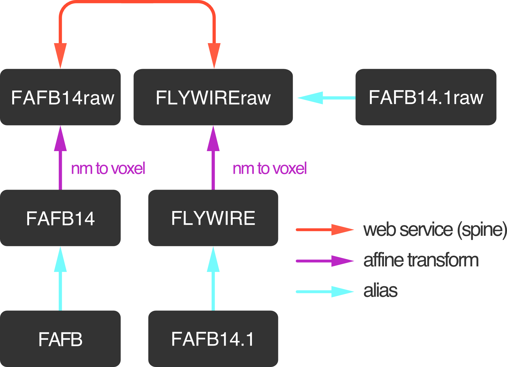
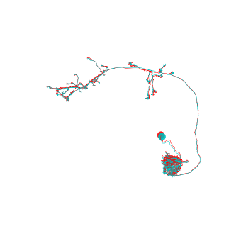

.. _transforming:

Transforming data between FAFB14 and flywire
============================================

Units matter!
*************
Before we get started there is one very important thing to keep in mind:

Spatial data can be in physical space (e.g. microns or nanometers) or in voxels.
For FAFB, you will typically find stuff to be in either nanometers or in
4x4x40nm voxels. Some simple rules of thumb:

1. Data (neurons, connectors, etc.) in CATMAID are in nanometers
2. Data (neuron meshes) in flywire are in nanometers
3. The CATMAID interface shows both physical units [nm] and voxels
4. The FlyWire neuroglancer interface typically uses voxels

Bottom line: you need to be aware of the units of the object you are trying to transform.

Transforming coordinates
************************
There are two ways to transform spatial data (neurons, meshes, x/y/z coordinates)
between FAFB14 and flywire (also called "FAFB14.1"). The most convenient way 
is to use ``navis`` built-in transform system. 

As soon as you import ``fafbseg``, the following transforms become available to navis:

|

   
|

Let's take it for a spin:

.. code:: ipython3

    import fafbseg
    import navis

.. raw:: html

    

First example: map a single location from FAFB14 to flywire.

In CATMAID, left-click on the little pin icon in the upper right (next to the `Pos, Id, ` field) to copy the current location (in nanometers) to the clipboard. Note that holding *shift* while clicking on the icon copies the location in voxels.

.. code:: ipython3

    # The location from the clipboard
    import numpy as np
    pos = np.array([[249960, 184691.375, 174240]])

Looking at above bridging graph, our coordinates are in ``"FAFB14"`` (nm) space and we want to go to ``"FLYWIREraw"`` (voxel) so that we can copy-paste the coordinates into the flywire neuroglancer":

.. code:: ipython3

    navis.xform_brain(pos, source='FAFB14', target='FLYWIREraw')

.. parsed-literal::

    Transform path: FAFB14 -> FAFB14raw -> FLYWIREraw

.. parsed-literal::

    array([[62648.5    , 46291.34375,  4356.     ]])

If you copy the above coordinates into the flywire neuroglancer, they should get you exactly to the same location.

The advantage of ``navis.xform_brain`` is that it ties in with other available transforms. So in theory, you could go from ``FLYWIRE`` all the way to ``JRC2018F`` with a command. 

The alternative to ``navis.xform_brain`` is to use a lower-level function: :func:`fafbseg.xform.fafb14_to_flywire`. This function and its inverse counterpart :func:`fafbseg.xform.flywire_to_fafb14` give you a bit more control over the transform.

.. code:: ipython3

    fafbseg.xform.fafb14_to_flywire(pos, coordinates='nm')

.. parsed-literal::

    array([[250594.  , 185165.38, 174240.  ]], dtype=float32)

Note that these lower-level functions always return in the same space - hence above result is also in nanometers.

Second example: transforming a neuron

.. code:: ipython3

    import pymaid
    cn = pymaid.connect_catmaid()
    
    # Load a neuron
    n = pymaid.get_neuron(16)
    
    # Xform the neuron - note we stay in nanometer space for now
    xf = navis.xform_brain(n, source='FAFB14', target='FLYWIRE')

.. parsed-literal::

    INFO  : Global CATMAID instance set. Caching is ON. (pymaid)

.. parsed-literal::

    Transform path: FAFB14 -> FAFB14raw -> FLYWIREraw -> FLYWIRE

.. code:: ipython3

    fig, ax = navis.plot2d([n, xf], color=['r', 'k'], lw=.5)
    ax.azim = ax.elev = -90

As you can see, the offsets are rather small - probably most obvious in the soma tract.
